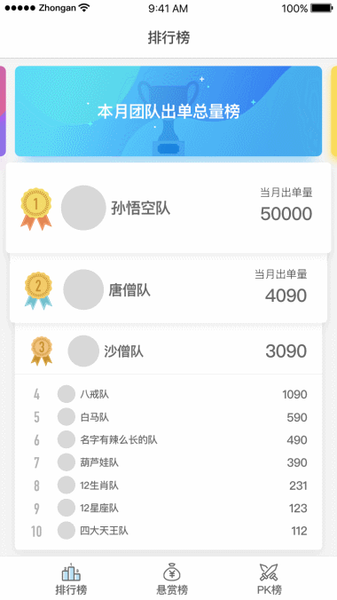

# 微信激励小程序

采用了 [wepy](https://tencent.github.io/wepy/document.html#/) 框架搭建小程序

小程序设计稿截屏如下：

## 踩过的坑
1. 小程序的最后一个元素在 ios 上 margin-bottom 无效，可用 padding-bottom 来实现
2. 小程序中切换输入 emoji 表情时，输入框会短暂失去焦点
3. 小程序打开的第一个页面需要全局异步获取的一个前置参数，
  可在全局定义一个 promise 状态，在全局异步获取到参数值后，
  然后在打开的第一个页面中执行 promise 的 then 方法，
  可参见 app.wpy 和 /pages/rank/index 页面的 globalData.process 变量
